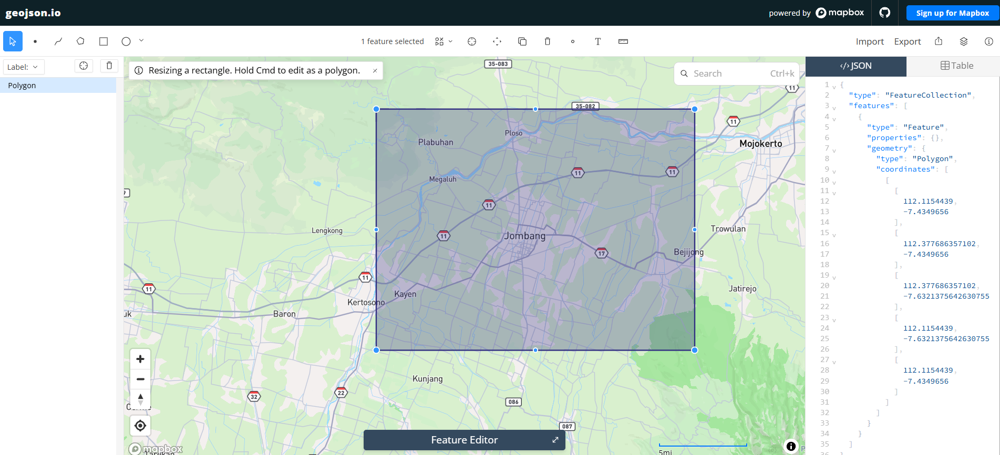
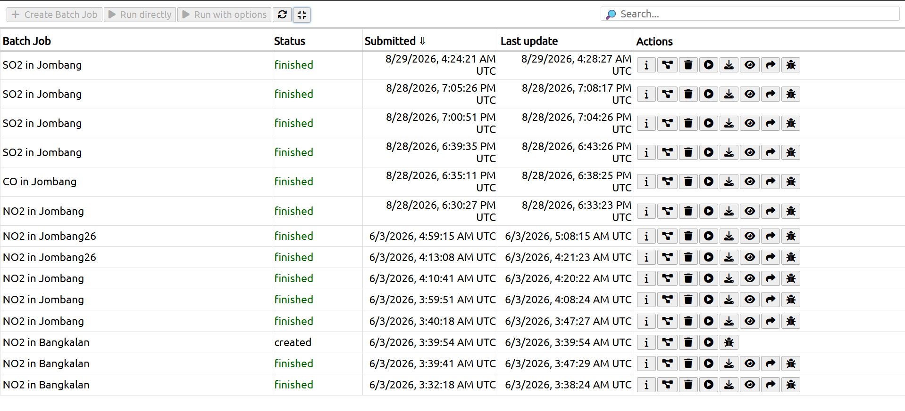

---
jupytext:
  formats: md:myst
  text_representation:
    extension: .md
    format_name: myst
    format_version: 0.13
    jupytext_version: 1.11.5
kernelspec:
  display_name: Python 3
  language: python
  name: python3
---

# Data Understanding

## Data Collection

Langkah pertama dalam proyek ini adalah mengumpulkan data polutan udara (seperti NO₂, CO, dan SO₂) yang bertipe deret waktu (_Time Series_). Dataset ini diambil dari platform satelit [Copernicus Data Space Ecosystem](https://dataspace.copernicus.eu/).

Buat akun terlebih dahulu di website Copernicus agar bisa melakukan crawling data menggunakan library openEO.

### Install Library

Untuk melakukan proses crawling data, kita membutuhkan pustaka Python pendukung yaitu `openeo` untuk berkomunikasi dengan API Copernicus, dan `netCDF4` untuk membaca format data cuaca spasial (`.nc`).

```bash
pip install openeo
pip install netCDF4
```

### Autentikasi dan Pengambilan Data

Skrip di bawah ini melakukan proses autentikasi untuk menghubungkan sistem lokal kita dengan server Copernicus menggunakan _device code flow_.

```python
import openeo

connection = openeo.connect("openeo.dataspace.copernicus.eu").authenticate_oidc()
```

Saat menjalankan baris di atas, akan muncul permintaan autentikasi:

```
Visit (link authentikasi) 📋 to authenticate.
✅ Authorized successfully
Authenticated using device code flow.
```

Klik link autentikasi lalu login menggunakan akun Copernicus.

### Definisi Area dan Pengambilan Data NO₂, CO dan SO₂ dari GeoJSON

Setelah berhasil masuk ke server Copernicus, langkah berikutnya adalah menentukan area analisis yang akan dipelajari. Dalam studi ini, fokus wilayah yang digunakan adalah Kabupaten Jombang, Jawa Timur. Batas wilayah ini ditentukan dengan bantuan alat pemetaan [geojson.io](https://geojson.io). Pada platform tersebut, kami menggambar poligon yang mengikuti batas administrasi atau area kota yang dipilih, lalu menyalin koordinat geografinya ke dalam variabel `aoi`.



Penentuan wilayah ini sangat penting karena data Sentinel-5P tidak langsung berupa data satu seri waktu di tingkat kabupaten. Data satelit ini tersusun dalam bentuk grid spasial dengan resolusi tertentu, sehingga sebelum dianalisis kita harus membatasi area ke wilayah Jombang dan mereduksi banyak piksel menjadi satu representasi yang mewakili kondisi kabupaten secara umum. Dalam konteks ini, `aoi` berfungsi sebagai pemotong area agar proses pengambilan data hanya fokus pada wilayah Jombang, bukan seluruh wilayah Indonesia.

Koordinat yang diperoleh kemudian dimasukkan ke dalam bentuk polygon `aoi` dan digunakan bersama dengan parameter `spatial_extent` serta `bands` untuk mengambil data polutan dari sensor Sentinel-5P. Parameter `bands` disesuaikan dengan kebutuhan analisis, yaitu NO₂, CO, dan SO₂. Setelah data diambil, dilakukan dua tahap aggregasi agar data lebih siap untuk analisis deret waktu.

Pertama, dilakukan **agregasi temporal harian** dengan `aggregate_temporal_period(reducer="mean", period="day")` untuk menghilangkan beberapa data yang mungkin tumpang tindih dalam satu hari. Kedua, dilakukan **agregasi spasial** dengan `aggregate_spatial(reducer="mean", geometries=aoi)` untuk menghitung rata-rata seluruh piksel di wilayah Jombang menjadi satu nilai per tanggal. Dengan cara ini, setiap hari akan memiliki satu nilai representatif yang menggambarkan kondisi rata-rata kualitas udara di wilayah tersebut.

```python
aoi = {
    "type": "Polygon",
    "coordinates": [
        [
            [
              112.1154439,
              -7.4349656
            ],
            [
              112.377686357102,
              -7.4349656
            ],
            [
              112.377686357102,
              -7.6321375642630755
            ],
            [
              112.1154439,
              -7.6321375642630755
            ],
            [
              112.1154439,
              -7.4349656
            ]
        ]
    ]
}

s5post = connection.load_collection(
    "SENTINEL_5P_L2",
    temporal_extent=["2025-08-25", "2026-08-25"],
    spatial_extent={
        "west": 112.1154439,
        "south": -7.6321375642630755,
        "east": 112.377686357102,
        "north": -7.4349656
    },
    bands=["SO2"],
)

# Agregasi harian agar tidak ada lebih dari satu data per hari
s5p_so2_daily = s5post.aggregate_temporal_period(reducer="mean", period="day")

# Agregasi spasial untuk menghasilkan rata-rata time series per AOI
s5p_so2_aoi = s5p_so2_daily.aggregate_spatial(reducer="mean", geometries=aoi)
```

Proses seperti ini penting karena data satelit awal masih bersifat spasial dan multidimensi. Tanpa agregasi, kita akan memiliki banyak nilai dari setiap piksel dalam wilayah Jombang, yang sulit dianalisis secara langsung. Dengan agregasi temporal dan spasial, data berubah menjadi format deret waktu yang lebih siap untuk diolah, divisualisasikan, dan dibandingkan antar polutan maupun antar periode waktu.

### Eksekusi Job dan Download

Setelah seluruh parameter area dan band telah ditentukan, proses agregasi data dikirim dalam bentuk job batch agar komputasi dilakukan di server Copernicus. Pada tahap ini, sistem akan memproses data satelit dalam rentang waktu yang telah ditetapkan, menghitung rata-rata harian, dan membentuk hasil akhir untuk wilayah Jombang.

```python
job = s5post.execute_batch(title="NO2 in Jombang", outputfile="NO2DiJombang.nc")
```

Tunggu sampai proses selesai. Status dan progres eksekusi dapat dipantau di [openEO editor](https://editor.openeo.org/?server=https%3A%2F%2Fopeneo.dataspace.copernicus.eu%2Fopeneo%2F1.2). Setelah job selesai, output file disimpan dalam format NetCDF dengan nama **`NO2DiJombang.nc`**. Format NetCDF ini sangat cocok untuk data geospasial karena mampu menyimpan variabel waktu, koordinat, serta nilai polutan dalam struktur yang terorganisir.

Pada tahap ini, kita tidak hanya mengambil data untuk satu band saja, tetapi proses yang sama juga dapat dilakukan untuk band CO dan SO₂. Dengan demikian, hasil akhirnya akan berupa beberapa file NetCDF yang masing-masing merepresentasikan satu jenis polutan di wilayah Jombang. Data tersebut kemudian akan diubah menjadi format tabel agar lebih mudah dibaca dan digunakan dalam analisis statistik maupun visualisasi.



```
0:00:00 Job 'j-2608250945264132925ebef4140e0037': send 'start'
0:00:03 Job 'j-2608250945264132925ebef4140e0037': queued (progress 0%)
0:00:08 Job 'j-2608250945264132925ebef4140e0037': queued (progress 0%)
0:00:15 Job 'j-2608250945264132925ebef4140e0037': queued (progress 0%)
0:00:23 Job 'j-2608250945264132925ebef4140e0037': queued (progress 0%)
0:00:33 Job 'j-2608250945264132925ebef4140e0037': queued (progress 0%)
0:00:46 Job 'j-2608250945264132925ebef4140e0037': running (progress N/A)
0:01:02 Job 'j-2608250945264132925ebef4140e0037': running (progress N/A)
0:01:21 Job 'j-2608250945264132925ebef4140e0037': running (progress N/A)
0:01:45 Job 'j-2608250945264132925ebef4140e0037': running (progress N/A)
0:02:16 Job 'j-2608250945264132925ebef4140e0037': running (progress N/A)
0:02:53 Job 'j-2608250945264132925ebef4140e0037': running (progress N/A)
0:03:40 Job 'j-2608250945264132925ebef4140e0037': finished (progress 100%)
```

### Simpan Data dalam Bentuk CSV

Format mentah NetCDF (`.nc`) yang dihasilkan oleh Sentinel-5P masih berbentuk matriks spasial tiga dimensi: dimensi waktu, baris, dan kolom. Struktur seperti ini tidak langsung cocok untuk analisis tabular karena kita perlu melihat perubahan nilai polutan dari hari ke hari, bukan pada setiap piksel secara individual. Oleh karena itu, file NetCDF perlu diolah lebih lanjut sebelum bisa digunakan untuk analisis lanjutan.

Pada tahap ini, kita mengekstraksi variabel waktu (`t`) dan variabel polutan (`NO2`), lalu mengonversinya ke dalam format tanggal yang mudah dibaca. Selanjutnya, seluruh nilai pada grid wilayah Jombang dirata-ratakan per hari agar dihasilkan satu angka yang mewakili kondisi rata-rata kabupaten pada hari tersebut. Langkah ini sangat penting agar data yang muncul di tabel CSV hanya berisi dua kolom utama, yaitu `date` dan `NO2`, sehingga mudah diproses untuk visualisasi serta pemodelan.

```python
import numpy as np
import pandas as pd
import netCDF4

file_path = "NO2DiJombang.nc"
ds = netCDF4.Dataset(file_path)
# Ambil data NO2
no2 = ds.variables["NO2"][:]

# Ambil dimensi waktu
time = ds.variables["t"][:]

# Konversi waktu ke format tanggal
try:
    time_units = ds.variables["t"].units
    dates = netCDF4.num2date(time, units=time_units)
except Exception:
    dates = time

new_dates = []
new_no2 = []

for i in range(len(dates)):
    new_date = dates[i].strftime('%Y-%m-%d')
    new_dates.append(new_date)
    new_no2.append(np.mean(no2[i]))

df = pd.DataFrame({
    "date": new_dates,
    "NO2": new_no2
})

# Simpan ke CSV
df.to_csv("NO2_Jombang_timeseries.csv", index=False)
```

Proses ini dilakukan juga untuk parameter lain seperti CO dan SO₂. Karena dataset asli berasal dari satelit, terdapat kemungkinan adanya nilai yang hilang atau tidak lengkap akibat bayangan awan, resolusi, atau keterbatasan sensor. Untuk menjaga konsistensi waktu dan meminimalkan gangguan, data yang masih kosong bisa ditangani dengan interpolasi linear sebelum dibuat menjadi time series. Setelah semua langkah ini selesai, dataset akan siap untuk masuk ke tahap analisis eksplorasi, seperti plotting, trend analysis, perbandingan antar polutan, atau pemodelan prediksi.

### Hasil CSV

Pada tahap akhir, file CSV hasil pembersihan dan agregasi untuk CO, SO₂, dan NO₂ dibaca menggunakan Pandas. Data ini sudah berubah dari bentuk raster menjadi format tabel yang memungkinkan kita melihat pola perubahan kualitas udara dalam rentang waktu tertentu. Dataset yang dihasilkan merepresentasikan seri waktu harian di wilayah Jombang dan siap digunakan untuk analisis lanjutan.

Berikut adalah cuplikan data tersebut:

1. CO

```{code-cell}
:tags: [hide-input]

import pandas as pd

df = pd.read_csv("../../CO_Jombang_timeseries.csv")

df.head(5)
```

2. SO2

```{code-cell}
:tags: [hide-input]
import pandas as pd

df = pd.read_csv("../../SO2_Jombang_timeseries.csv")

df.head(5)
```

3. NO₂

```{code-cell}
:tags: [hide-input]
import pandas as pd

df = pd.read_csv("../../NO2_Jombang_timeseries.csv")

df.head(5)
```
