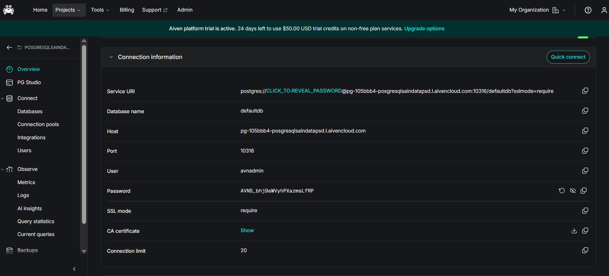
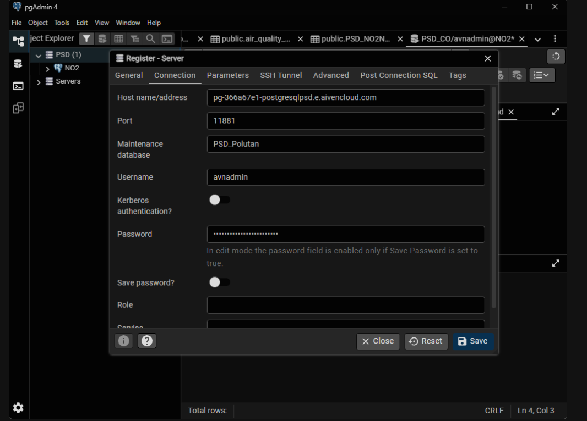
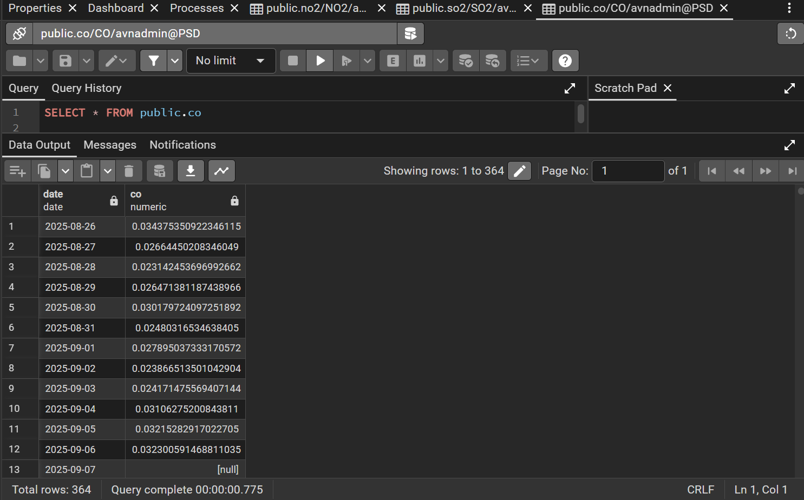
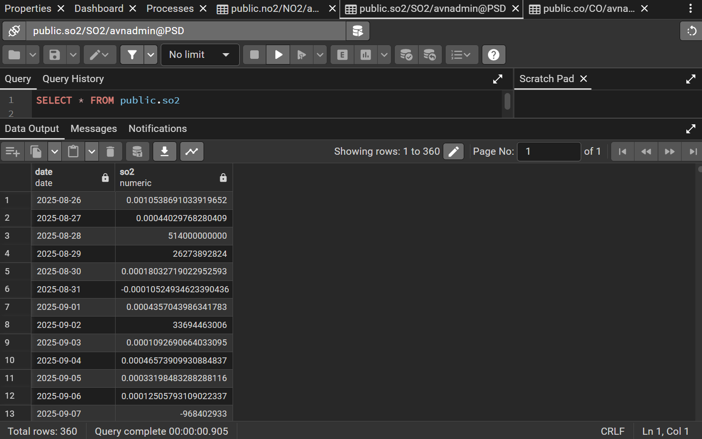
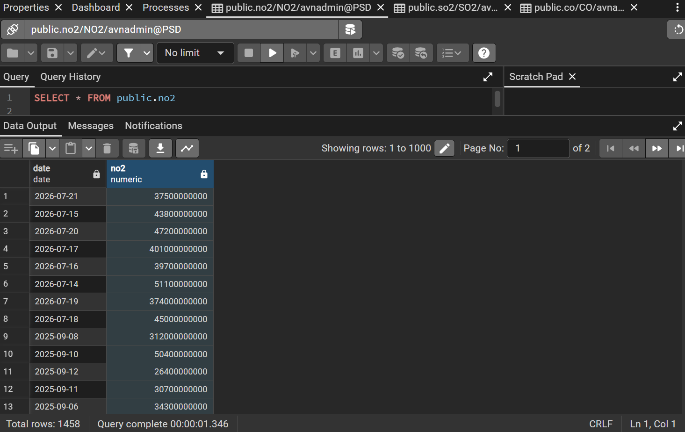
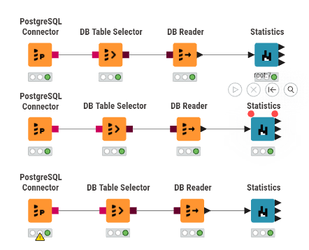
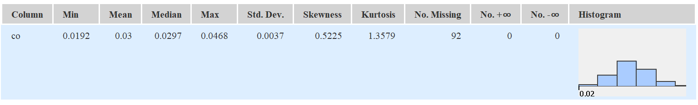
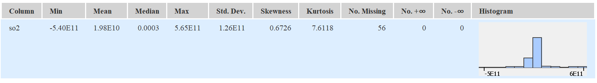
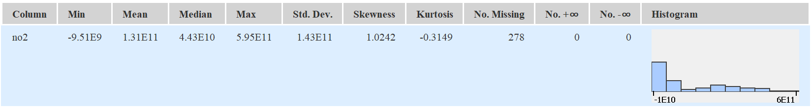

# Penjelasan Metrik Statistika Deskriptif

Dalam analisis data, ringkasan metrik yang disajikan dalam bentuk tabel disebut sebagai **Statistika Deskriptif (Descriptive Statistics)**. Ringkasan ini umumnya dimanfaatkan pada tahap awal analisis, yakni **Exploratory Data Analysis (EDA)**. Tujuannya adalah untuk memahami karakteristik, pola distribusi, serta kualitas data sebelum beralih ke tahap pemrosesan lanjutan, peramalan (_forecasting_), maupun pemodelan.

Tabel tersebut menyajikan ringkasan untuk beberapa variabel konsentrasi polutan udara ($CO$, $SO_2$, dan $NO_2$). Berikut merupakan penjelasan untuk masing-masing metrik beserta metode perhitungan manualnya:

## 1. Min & Max

- **Penjelasan:** Merupakan nilai observasi terendah (Min) dan tertinggi (Max) dalam suatu kumpulan data. Metrik ini berguna untuk mengidentifikasi batas bawah dan batas atas dari rentang data.
- **Perhitungan Manual:** Urutkan seluruh data mulai dari nilai yang terkecil hingga yang terbesar.
  - $Min = X_1$ (Data pada urutan pertama)
  - $Max = X_n$ (Data pada urutan terakhir)

## 2. Mean

- **Penjelasan:** Merupakan nilai pusat (rata-rata) dari sekumpulan data. Nilai ini diperoleh dengan menjumlahkan seluruh observasi, kemudian membaginya dengan total jumlah observasi yang valid.
- **Perhitungan Manual:**

  $$ \bar{x} = \frac{\sum\_{i=1}^{n} x_i}{n} $$

  _(Jumlahkan seluruh nilai konsentrasi polutan, lalu bagi dengan total baris data yang tersedia)_.

## 3. Std. Deviation (Standar Deviasi)

- **Penjelasan:** Mengukur sejauh mana rata-rata simpangan titik-titik data terhadap nilai Mean-nya. Standar deviasi yang rendah mengindikasikan bahwa data cenderung mengelompok di sekitar rata-rata (konsisten), sementara nilai yang tinggi menunjukkan adanya rentang fluktuasi yang lebar.
- **Perhitungan Manual (Sampel):**

  $$ s = \sqrt{\frac{\sum\_{i=1}^{n} (x_i - \bar{x})^2}{n-1}} $$

## 4. Variance (Varians)

- **Penjelasan:** Merupakan rata-rata dari kuadrat selisih antara setiap titik data dengan nilai Mean. Secara matematis, varians adalah nilai kuadrat dari Standar Deviasi.
- **Perhitungan Manual (Sampel):**

  $$ s^2 = \frac{\sum\_{i=1}^{n} (x_i - \bar{x})^2}{n-1} $$

## 5. Skewness

- **Penjelasan:** Mengukur tingkat asimetri (ketidakseimbangan) distribusi data terhadap nilai rata-ratanya.
  - _Skewness = 0_: Data terdistribusi secara simetris (normal) dan berpusat di tengah.
  - _Skewness > 0 (Positif)_: Ekor distribusi memanjang ke arah kanan (menunjukkan adanya nilai ekstrem yang tinggi). Pada hasil KNIME, nilai skewness positif terdapat pada kolom $SO_2$, yaitu 0.6726.
  - _Skewness < 0 (Negatif)_: Ekor distribusi memanjang ke arah kiri.
- **Perhitungan Manual (Fisher-Pearson):**

  $$ Skewness = \frac{n}{(n-1)(n-2)} \sum\_{i=1}^{n} \left(\frac{x_i - \bar{x}}{s}\right)^3 $$

## 6. Kurtosis

- **Penjelasan:** Mengukur tingkat keruncingan atau bobot ekor (_tailedness_) dari suatu distribusi data. Metrik ini menunjukkan seberapa ekstrem _outlier_ (pencilan) yang ada di dalam data. Sebagian besar perangkat lunak (_software_) secara khusus menghitung _Excess Kurtosis_.
  - _Kurtosis ≈ 0_: Distribusi normal (Mesokurtik).
  - _Kurtosis > 0_: Memiliki puncak yang tajam dengan ekor yang tebal, mengindikasikan adanya nilai ekstrem (Leptokurtik). Pada hasil KNIME, kolom $SO_2$ memiliki kurtosis 7.6118 dan kolom $CO$ memiliki kurtosis 1.3579.
  - _Kurtosis < 0_: Puncaknya cenderung lebih datar dibandingkan distribusi normal (Platikurtik). Tidak ada contoh kurtosis negatif yang digunakan pada tiga kolom dalam perhitungan manual ini.
- **Perhitungan Manual (Excess Kurtosis Sampel):**

  $$ Kurtosis = \left[ \frac{n(n+1)}{(n-1)(n-2)(n-3)} \sum \left(\frac{x_i - \bar{x}}{s}\right)^4 \right] - \frac{3(n-1)^2}{(n-2)(n-3)} $$

## 7. Overall Sum

- **Penjelasan:** Merupakan jumlah total dari keseluruhan nilai pada variabel yang bersangkutan.
- **Perhitungan Manual:**

  $$ Sum = \sum\_{i=1}^{n} x_i $$

## 8. Metrik Kualitas / Anomali Data

Kelompok metrik ini memegang peranan krusial saat melakukan ekstraksi data mentah melalui API atau dari citra satelit, karena rentan terhadap kegagalan saat proses perekaman nilai.

- **No. missings:** Menunjukkan jumlah sel yang kosong (NULL / NA) akibat data tidak berhasil terekam pada periode waktu tertentu.
- **No. NaNs (Not a Number):** Menunjukkan jumlah entri yang dapat dibaca tetapi nilainya tidak terdefinisi secara matematis (contohnya 0/0).
- **No. +infs / No. -infs:** Menunjukkan adanya nilai batas tak terhingga.
- **Perhitungan Manual:** Menghitung frekuensi (N) kemunculan baris yang memuat nilai-nilai khusus tersebut.

## 9. Median

- _Catatan: Pada tabel sebelumnya, nilai Median belum dihitung secara menyeluruh (ditunjukkan dengan ikon tanda tanya berwarna merah)._
- **Penjelasan:** Merupakan nilai yang persis berada di tengah kumpulan data setelah diurutkan. Metrik ini kerap dimanfaatkan sebagai alternatif pengganti rata-rata (Mean) sebab Median tidak rentan terhadap pengaruh nilai _outlier_ yang ekstrem.
- **Perhitungan Manual:** Urutkan seluruh data mulai dari $X_1$ hingga $X_n$.
  - Bila jumlah observasi ($n$) bernilai ganjil: $Median = X_{(n+1)/2}$
  - Bila jumlah observasi ($n$) bernilai genap: $Median = \frac{X_{n/2} + X_{(n/2)+1}}{2}$

# **Implementasi Analisis Data Polutan: Dari Cloud Database ke KNIME**

Panduan ini menguraikan tahapan-tahapan untuk menghubungkan database PostgreSQL di platform Aiven, melakukan inspeksi data menggunakan DBeaver, serta mengekstraksi metrik statistika deskriptif menggunakan KNIME Analytics Platform. Pada konfigurasi terbaru, layanan PostgreSQL Aiven menggunakan database `defaultdb`, host khusus Aiven, port `10316`, pengguna `avnadmin`, dan koneksi terenkripsi dengan SSL mode `require`.

## Langkah 1: Memperoleh Kredensial Database dari Aiven

Sebelum membuka koneksi melalui DBeaver atau KNIME, parameter koneksi harus diambil dari dashboard Aiven yang sedang aktif. Informasi pada dashboard menjadi acuan utama karena host dan port setiap layanan Aiven dapat berbeda.

1. Akses _dashboard_ atau console **Aiven**, lalu buka proyek yang digunakan untuk menyimpan layanan PostgreSQL.
2. Pada menu **Projects**, buka layanan PostgreSQL yang sedang aktif, kemudian pilih halaman **Overview**.
3. Buka bagian **Connection information**. Berdasarkan konfigurasi pada screenshot Anda, parameter koneksinya adalah:
   - **Database name:** `defaultdb`
   - **Host:** `pg-105bbb4-posgresqlsaindatapsl.aivencloud.com`
   - **Port:** `10316`
   - **User:** `avnadmin`
   - **Password:** gunakan password yang ditampilkan melalui ikon mata atau tombol salin pada dashboard Aiven
   - **SSL mode:** `require`
4. Password tidak perlu ditulis ke dalam laporan atau kode sumber. Masukkan password langsung pada kolom kredensial DBeaver dan KNIME, atau simpan melalui pengelola kredensial aplikasi.
5. Apabila aplikasi klien meminta sertifikat, buka bagian **CA certificate**, pilih **Show**, lalu unduh sertifikat tersebut. Sertifikat ini digunakan untuk memverifikasi keamanan koneksi PostgreSQL.

Konfigurasi tersebut dapat ditulis dalam bentuk URI PostgreSQL berikut. Bagian `<PASSWORD>` harus diganti langsung pada aplikasi dan tidak disimpan di repository:

```text
postgresql://avnadmin:<PASSWORD>@pg-105bbb4-posgresqlsaindatapsl.aivencloud.com:10316/defaultdb?sslmode=require
```



---

## Langkah 2: Mengonfigurasi Koneksi di DBeaver

DBeaver digunakan untuk menguji koneksi dan meninjau tabel beserta datanya secara langsung sebelum data diproses di KNIME. Pengujian ini penting karena dapat memastikan bahwa host, port, database, username, password, dan SSL sudah benar.

1. Buka aplikasi **DBeaver**, lalu pilih **New Database Connection**.
2. Pilih jenis database **PostgreSQL**, kemudian klik **Next**.
3. Pada tab **Main** atau **Connection**, isikan parameter berikut:
   - **Host:** `pg-105bbb4-posgresqlsaindatapsl.aivencloud.com`
   - **Port:** `10316`
   - **Database:** `defaultdb`
   - **Username:** `avnadmin`
   - **Password:** masukkan password dari dashboard Aiven
4. Buka pengaturan SSL pada koneksi DBeaver, lalu tetapkan mode SSL menjadi **require**. Jika DBeaver meminta CA certificate, pilih file sertifikat yang diunduh dari Aiven.
5. Klik **Test Connection**. Koneksi dianggap berhasil apabila DBeaver dapat terhubung tanpa pesan kegagalan autentikasi atau kegagalan SSL.
6. Klik **Finish** untuk menyimpan koneksi. Beri nama koneksi yang mudah dikenali, misalnya `Aiven PSD Polutan`.

Jika koneksi gagal, periksa kembali tiga hal utama: port harus `10316`, nama database harus `defaultdb`, dan SSL harus diatur ke `require`. Kesalahan satu karakter pada host atau penggunaan port lama dapat menyebabkan DBeaver tidak menemukan server.



---

## Langkah 3: Melakukan Inspeksi Tabel Data di DBeaver

Setelah koneksi berhasil, data perlu diperiksa terlebih dahulu untuk memastikan tabel dan kolom yang digunakan memang tersedia di database `defaultdb`.

1. Pada panel **Database Navigator** DBeaver, buka koneksi `Aiven PSD Polutan`.
2. Navigasikan struktur database melalui `defaultdb` > **Schemas** > `public` > **Tables**.
3. Pilih tabel `polutan`, kemudian klik kanan dan pilih **View Data** > **All Rows**.
4. Pastikan kolom deret waktu yang terlihat adalah `date`, `co`, `so2`, dan `no2`. Keempat kolom tersebut menjadi dasar analisis polutan dalam laporan ini.
5. Periksa tipe data setiap kolom. Kolom `date` harus berisi tanggal, sedangkan kolom `co`, `so2`, dan `no2` harus dapat dibaca sebagai angka.
6. Nilai `[null]` atau sel kosong perlu dicatat sebagai _missing values_. Nilai tersebut tidak boleh langsung dianggap sebagai angka nol karena dapat mengubah rata-rata, variance, skewness, dan hasil analisis lainnya.
7. Setelah pemeriksaan selesai, catat nama tabel dan nama kolom secara tepat agar konfigurasi node KNIME menggunakan sumber data yang sama.





---

## Langkah 4: Menyusun Alur Kerja (Workflow) di KNIME

Beralih menuju KNIME Analytics Platform guna menarik data dari database dan melakukan perhitungan statistiknya secara otomatis.

1. Jalankan **KNIME Analytics Platform** lalu buatlah _workflow_ (alur kerja) yang baru.
2. Tarik (_drag-and-drop_) _node_ di bawah ini dari _Node Repository_ menuju ke _workspace_:
   - **PostgreSQL Connector:** Berfungsi menghubungkan KNIME dengan server Aiven.
   - **DB Table Selector:** Berfungsi untuk menyeleksi tabel di dalam database.
   - **DB Reader:** Berfungsi untuk memuat tabel ke dalam memori KNIME.
   - **Statistics:** Berfungsi untuk menghitung metrik-metrik statistik.
3. Hubungkan setiap _node_ tersebut mengikuti urutan yang telah disebutkan di atas.
4. **Konfigurasi Node:**
   - Lakukan klik ganda pada **PostgreSQL Connector**, lalu isikan _Hostname_ `pg-105bbb4-posgresqlsaindatapsl.aivencloud.com`, _Port_ `10316`, _Database name_ `defaultdb`, serta _Credentials_ (`avnadmin` dan password Aiven) yang identik dengan langkah 1 dan 2.
   - Atur SSL pada konfigurasi koneksi menjadi `require` apabila tersedia pada dialog node atau driver PostgreSQL.
   - Lakukan klik ganda pada **DB Table Selector**, kemudian pilih skema `public` serta tabel `polutan`.
5. Klik kanan pada **DB Reader** lalu pilih opsi **Execute**. Jika prosesnya berhasil, lampu indikator di bagian bawah _node_ akan berubah menjadi hijau.



---

## Langkah 5: Membaca Output Statistika Deskriptif

Setelah data berhasil dimuat ke dalam KNIME, tahapan yang terakhir adalah menjalankan perhitungan analitiknya.

1. Klik kanan pada node **Statistics** kemudian pilih **Execute**.
2. Bila lampu indikator telah berwarna hijau, klik kanan kembali pada node **Statistics** lalu pilih menu **Statistics View** (atau ikon bergambar kaca pembesar).
3. Tabel metrik statistik akan ditampilkan, yang memuat:
   - **Min, Max, Mean:** Guna mengamati rentang serta nilai rata-rata dari masing-masing polutan.
   - **Std. deviation & Variance:** Guna meninjau tingkat fluktuasi nilai gas di udara.
   - **Skewness & Kurtosis:** Guna melihat bentuk asimetri dan tingkat keberadaan nilai-nilai yang ekstrem (_outlier_).
   - **No. missings:** Menyatakan jumlah data yang kosong. Pada perhitungan manual ini, kolom $CO$ memiliki 92 missing, kolom $SO_2$ memiliki 56 missing, dan kolom $NO_2$ memiliki 278 missing.
   - **Histogram:** Menyajikan visualisasi mengenai sebaran datanya.





### Perhitungan Manual

Perhitungan manual di bawah ini menggunakan hasil pada gambar output KNIME sebagai acuan. Total baris dataset adalah 365 baris, sehingga jumlah data valid (`n`) tiap kolom dihitung dari `n = 365 - No. Missing`. Karena angka pada gambar KNIME ditampilkan dengan pembulatan, hasil turunan di bawah ini juga merupakan pendekatan berdasarkan angka yang terlihat.

## Kolom `CO`

Diketahui:

$$
n &= 365 - 92 = 273 \\
\bar{x} &= 0.03
$$

1. Standar Deviasi
   $$ s = \sqrt{\frac{\sum\_{i=1}^{n} (x_i - \bar{x})^2}{n-1}} $$
   dimana:

- $x_i$ adalah data ke $i$
- $\bar{x}$ adalah rata rata dari $x$
- $n$ adalah jumlah baris (dikarenakan terdapat missing values, $n = total baris - missing values$)

Std. Dev. yang tercatat pada tabel adalah $s = 0.0037$, sehingga jumlah kuadrat deviasi dapat ditelusuri kembali:

$$
\sum_{i=1}^{n}(x_i-\bar{x})^2 &= s^2 \times (n-1) \\
\\
\sum_{i=1}^{n}(x_i-\bar{x})^2 &= 0.0037^2 \times (273-1) \\
\\
\sum_{i=1}^{n}(x_i-\bar{x})^2 &= 0.00372368
$$

$$
s &= \sqrt{\frac{0.00372368}{273-1}}\\
\\
s &= \sqrt{0.0000136900}\\
\\
s &= 0.0037
$$

2. Variansi
   Variansi dapat diketahui dengan mengkuadratkan `Standar Deviasi`

   $$
   v &= s^2\\
   \\
   v &= 0.0037^2\\
   \\
   v &= 1.369E-05
   $$

3. Skewness
   $$ Skewness = \frac{n}{(n-1)(n-2)} \sum\_{i=1}^{n} \left(\frac{x_i - \bar{x}}{s}\right)^3 $$
   Rumus diatas dapat dikelompokkan menjadi 2 untuk mempermudah perhitungan sehingga menjadi rumus sebagai berikut

   $$
   Skewness &= \underbrace{\frac{n}{(n-1)(n-2)}}_{A} \underbrace{\sum_{i=1}^{n}\left(\frac{x_i-\bar{x}}{s}\right)^3}_{B}\\
   \\
   A &= \frac{n}{(n-1)(n-2)}\\
   \\
   A &= \frac{273}{(273-1)(273-2)} = \frac{273}{73712}\\
   \\
   A &= 0.0037036\\
   \\
   B &= \sum_{i=1}^{n}\left(\frac{x_i-\bar{x}}{s}\right)^3\\
   \\
   B &= \left(\frac{x_1 - 0.03}{0.0037}\right)^3 + \left(\frac{x_2 - 0.03}{0.0037}\right)^3 + \ldots + \left(\frac{x_n - 0.03}{0.0037}\right)^3\\
   \\
   B &= \frac{Skewness}{A} = \frac{0.5225}{0.0037036}\\
   \\
   B &= 141.0788\\
   \\
   Skewness &= 0.0037036 \times 141.0788\\
   \\
   Skewness &= 0.5225
   $$

4. Kurtosis
   $$ Kurtosis = \left[ \frac{n(n+1)}{(n-1)(n-2)(n-3)} \sum \left(\frac{x_i - \bar{x}}{s}\right)^4 \right] - \frac{3(n-1)^2}{(n-2)(n-3)} $$
   Rumus diatas dapat dikelompokkan menjadi 3 untuk mempermudah perhitungan sehingga menjadi rumus sebagai berikut

   $$
   Kurtosis &= \left[ \underbrace{\frac{n(n+1)}{(n-1)(n-2)(n-3)}}_{A} \underbrace{\sum \left(\frac{x_i - \bar{x}}{s}\right)^4}_{B} \right] - \underbrace{\frac{3(n-1)^2}{(n-2)(n-3)}}_{C} \\
   \\
   A &= \frac{273(273+1)}{(273-1)(273-2)(273-3)}\\
   \\
   A &= \frac{74802}{19902240}\\
   \\
   A &= 0.0037585 \\
   \\
   C &= \frac{3(n-1)^2}{(n-2)(n-3)}\\
   \\
   C &= \frac{3(273-1)^2}{(273-2)(273-3)}\\
   \\
   C &= \frac{221952}{73170}\\
   \\
   C &= 3.033374\\
   \\
   B &= \sum_{i=1}^{n}\left(\frac{x_i-\bar{x}}{s}\right)^4\\
   \\
   B &= \left(\frac{x_1 - 0.03}{0.0037}\right)^4 + \left(\frac{x_2 - 0.03}{0.0037}\right)^4 + \ldots + \left(\frac{x_n - 0.03}{0.0037}\right)^4\\
   \\
   B &= \frac{Kurtosis + C}{A} = \frac{1.3579 + 3.033374}{0.0037585}\\
   \\
   B &= 1168.3671\\
   \\
   Kurtosis &= 0.0037585 \times 1168.3671 - 3.033374\\
   \\
   Kurtosis &= 1.3579
   $$

5. Overall Sum
   Overall Sum adalah jumlah keseluruhan atau total dari seluruh nilai angka dalam suatu kumpulan data
   $$
   \begin{aligned}
   OS &= \sum_{i=1}^{n}x_i \\
   \\
   OS &= \bar{x} \times n \\
   \\
   OS &= 0.03 \times 273 \\
   \\
   OS &= 8.19
   \end{aligned}
   $$

## Kolom `SO2`

Diketahui:

$$
n &= 365 - 56 = 309 \\
\bar{x} &= 1.98E10
$$

1. Standar Deviasi
   Std. Dev. yang tercatat pada tabel adalah $s = 1.26E11$, sehingga jumlah kuadrat deviasi dapat ditelusuri kembali:

   $$
   \sum_{i=1}^{n}(x_i-\bar{x})^2 &= s^2 \times (n-1) \\
   \\
   \sum_{i=1}^{n}(x_i-\bar{x})^2 &= (1.26E11)^2 \times (309-1) \\
   \\
   \sum_{i=1}^{n}(x_i-\bar{x})^2 &= 4.889808E24
   $$

   $$
   s &= \sqrt{\frac{4.889808E24}{309-1}}\\
   \\
   s &= \sqrt{1.5876E22}\\
   \\
   s &= 1.26E11
   $$

2. Variansi

   $$
   v &= s^2\\
   \\
   v &= (1.26E11)^2\\
   \\
   v &= 1.5876E22
   $$

3. Skewness

   $$
   Skewness &= \underbrace{\frac{n}{(n-1)(n-2)}}_{A} \underbrace{\sum_{i=1}^{n}\left(\frac{x_i-\bar{x}}{s}\right)^3}_{B}\\
   \\
   A &= \frac{309}{(309-1)(309-2)} = \frac{309}{94556}\\
   \\
   A &= 0.0032679\\
   \\
   B &= \left(\frac{x_1 - 1.98E10}{1.26E11}\right)^3 + \left(\frac{x_2 - 1.98E10}{1.26E11}\right)^3 + \ldots + \left(\frac{x_n - 1.98E10}{1.26E11}\right)^3\\
   \\
   B &= \frac{Skewness}{A} = \frac{0.6726}{0.0032679}\\
   \\
   B &= 205.8200\\
   \\
   Skewness &= 0.0032679 \times 205.8200\\
   \\
   Skewness &= 0.6726
   $$

4. Kurtosis

   $$
   A &= \frac{309(309+1)}{(309-1)(309-2)(309-3)}\\
   \\
   A &= \frac{95790}{28934136}\\
   \\
   A &= 0.0033106 \\
   \\
   C &= \frac{3(309-1)^2}{(309-2)(309-3)}\\
   \\
   C &= \frac{284592}{93942}\\
   \\
   C &= 3.029444\\
   \\
   B &= \left(\frac{x_1 - 1.98E10}{1.26E11}\right)^4 + \left(\frac{x_2 - 1.98E10}{1.26E11}\right)^4 + \ldots + \left(\frac{x_n - 1.98E10}{1.26E11}\right)^4\\
   \\
   B &= \frac{Kurtosis + C}{A} = \frac{7.6118 + 3.029444}{0.0033106}\\
   \\
   B &= 3214.2728\\
   \\
   Kurtosis &= 0.0033106 \times 3214.2728 - 3.029444\\
   \\
   Kurtosis &= 7.6118
   $$

5. Overall Sum
   $$
   \begin{aligned}
   OS &= \bar{x} \times n \\
   \\
   OS &= 1.98E10 \times 309 \\
   \\
   OS &= 6.1182E12
   \end{aligned}
   $$

## Kolom `NO2`

Diketahui:

$$
n &= 365 - 278 = 87 \\
\bar{x} &= 1.31E11
$$

1. Standar Deviasi
   Std. Dev. yang tercatat pada tabel adalah $s = 1.43E11$, sehingga jumlah kuadrat deviasi dapat ditelusuri kembali:

   $$
   \sum_{i=1}^{n}(x_i-\bar{x})^2 &= s^2 \times (n-1) \\
   \\
   \sum_{i=1}^{n}(x_i-\bar{x})^2 &= (1.43E11)^2 \times (87-1) \\
   \\
   \sum_{i=1}^{n}(x_i-\bar{x})^2 &= 1.758614E24
   $$

   $$
   s &= \sqrt{\frac{1.758614E24}{87-1}}\\
   \\
   s &= \sqrt{2.0449E22}\\
   \\
   s &= 1.43E11
   $$

2. Variansi

   $$
   v &= s^2\\
   \\
   v &= (1.43E11)^2\\
   \\
   v &= 2.0449E22
   $$

3. Skewness

   $$
   Skewness &= \underbrace{\frac{n}{(n-1)(n-2)}}_{A} \underbrace{\sum_{i=1}^{n}\left(\frac{x_i-\bar{x}}{s}\right)^3}_{B}\\
   \\
   A &= \frac{87}{(87-1)(87-2)} = \frac{87}{7310}\\
   \\
   A &= 0.0119015\\
   \\
   B &= \left(\frac{x_1 - 1.31E11}{1.43E11}\right)^3 + \left(\frac{x_2 - 1.31E11}{1.43E11}\right)^3 + \ldots + \left(\frac{x_n - 1.31E11}{1.43E11}\right)^3\\
   \\
   B &= \frac{Skewness}{A} = \frac{1.0242}{0.0119015}\\
   \\
   B &= 86.0563\\
   \\
   Skewness &= 0.0119015 \times 86.0563\\
   \\
   Skewness &= 1.0242
   $$

4. Kurtosis

   $$
   A &= \frac{87(87+1)}{(87-1)(87-2)(87-3)}\\
   \\
   A &= \frac{7656}{614040}\\
   \\
   A &= 0.0124682 \\
   \\
   C &= \frac{3(87-1)^2}{(87-2)(87-3)}\\
   \\
   C &= \frac{22188}{7140}\\
   \\
   C &= 3.107563\\
   \\
   B &= \left(\frac{x_1 - 1.31E11}{1.43E11}\right)^4 + \left(\frac{x_2 - 1.31E11}{1.43E11}\right)^4 + \ldots + \left(\frac{x_n - 1.31E11}{1.43E11}\right)^4\\
   \\
   B &= \frac{Kurtosis + C}{A} = \frac{-0.3149 + 3.107563}{0.0124682}\\
   \\
   B &= 223.9821\\
   \\
   Kurtosis &= 0.0124682 \times 223.9821 - 3.107563\\
   \\
   Kurtosis &= -0.3149
   $$

5. Overall Sum
   $$
   \begin{aligned}
   OS &= \bar{x} \times n \\
   \\
   OS &= 1.31E11 \times 87 \\
   \\
   OS &= 1.1397E13
   \end{aligned}
   $$
