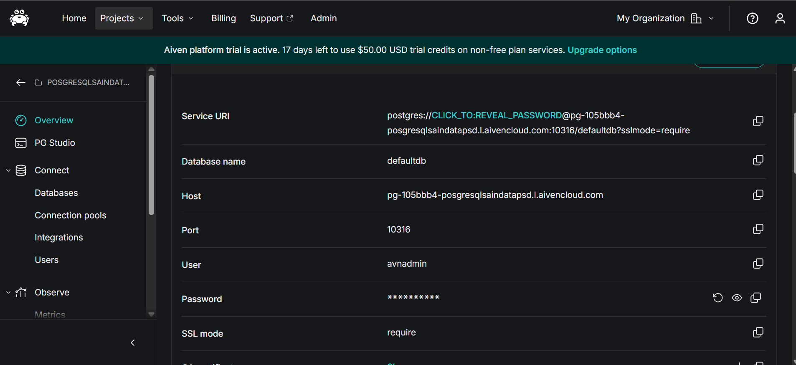
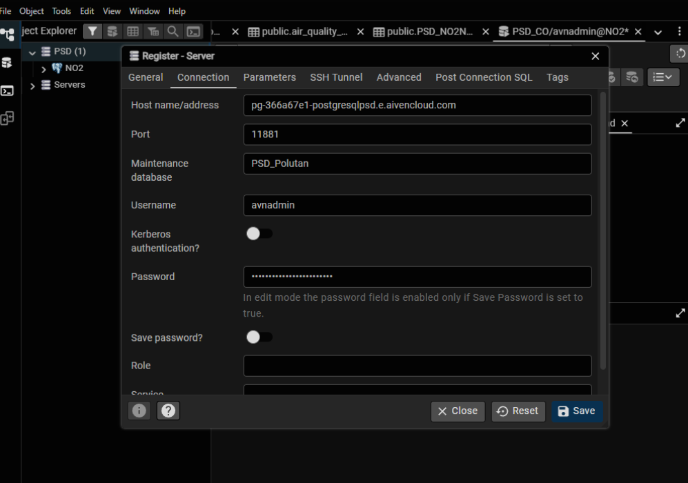
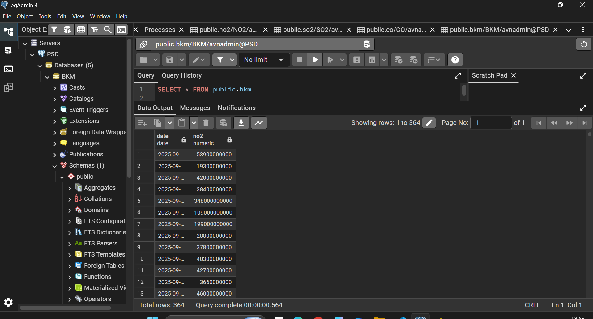
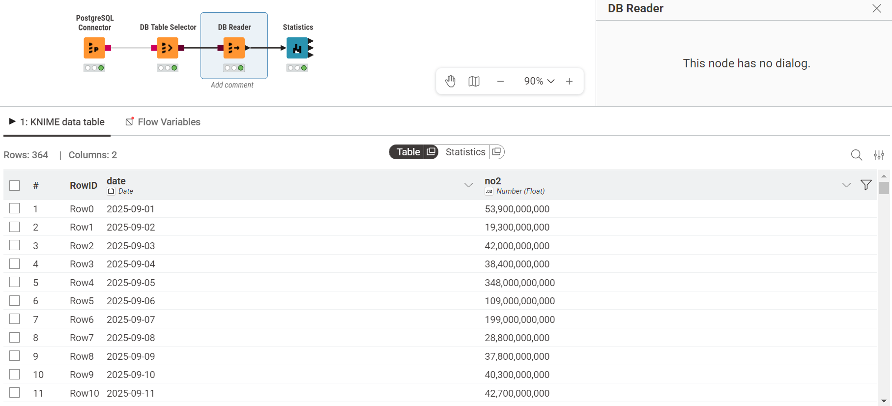
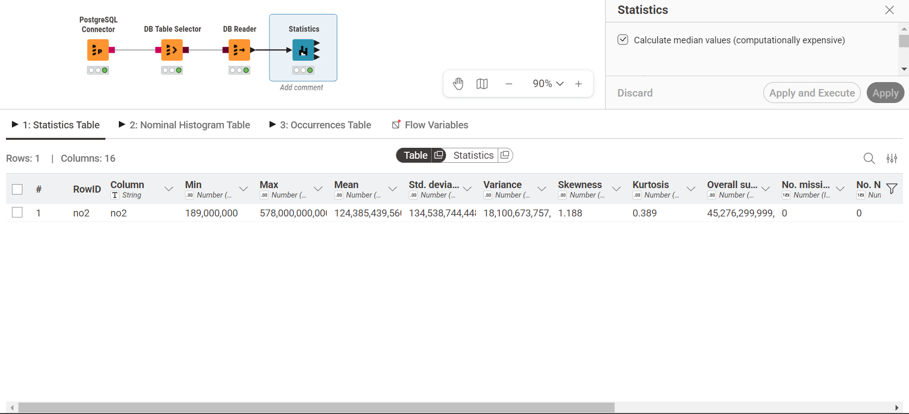
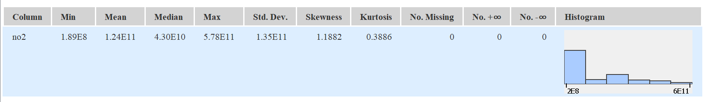

# Penjelasan Metrik Statistika Deskriptif Bandarkedungmulyo (NO2)

Dalam analisis data, ringkasan metrik yang disajikan dalam bentuk tabel disebut sebagai **Statistika Deskriptif (Descriptive Statistics)**. Ringkasan ini umumnya dimanfaatkan pada tahap awal analisis, yakni **Exploratory Data Analysis (EDA)**. Tujuannya adalah untuk memahami karakteristik, pola distribusi, serta kualitas data sebelum beralih ke tahap pemrosesan lanjutan, peramalan (_forecasting_), maupun pemodelan.

Seluruh hasil pada bagian ini dihitung hanya dari file `NO2_Bandarkedungmulyo_timeseries_final.csv` yang dilampirkan. File tersebut tidak memiliki header dan menggunakan pemisah titik koma (`;`): kolom pertama berisi tanggal dan kolom kedua berisi nilai NO2. Dataset berisi 365 baris harian pada periode 31 Agustus 2025 sampai 30 Agustus 2026. Seluruh 365 nilai NO2 terbaca sebagai nilai numerik dan tidak terdapat missing value.

Tabel berikut hanya menyajikan ringkasan konsentrasi NO2 beserta metode perhitungan manualnya:

## 1. Min & Max

- **Penjelasan:** Merupakan nilai observasi terendah (Min) dan tertinggi (Max) dalam suatu kumpulan data. Metrik ini berguna untuk mengidentifikasi batas bawah dan batas atas dari rentang data.
- **Perhitungan Manual:** Urutkan seluruh data mulai dari nilai yang terkecil hingga yang terbesar.
  - $Min = X_1$ (Data pada urutan pertama)
  - $Max = X_n$ (Data pada urutan terakhir)

### Hasil Perhitungan

| Polutan |       Min |          Max |
| ------- | --------: | -----------: |
| NO2     | 189000000 | 578000000000 |

## 2. Mean

- **Penjelasan:** Merupakan nilai pusat (rata-rata) dari sekumpulan data. Nilai ini diperoleh dengan menjumlahkan seluruh observasi, kemudian membaginya dengan total jumlah observasi yang valid.
- **Perhitungan Manual:**

  $$ \bar{x} = \frac{\sum\_{i=1}^{n} x_i}{n} $$

  _(Jumlahkan seluruh nilai konsentrasi polutan, lalu bagi dengan total baris data yang tersedia)_.

### Hasil Perhitungan

| Polutan | n valid |            Mean |
| ------- | ------: | --------------: |
| NO2     |     365 | 1.241260274E+11 |

## 3. Std. Deviation (Standar Deviasi)

- **Penjelasan:** Mengukur sejauh mana rata-rata simpangan titik-titik data terhadap nilai Mean-nya. Standar deviasi yang rendah mengindikasikan bahwa data cenderung mengelompok di sekitar rata-rata (konsisten), sementara nilai yang tinggi menunjukkan adanya rentang fluktuasi yang lebar.
- **Perhitungan Manual (Sampel):**

  $$ s = \sqrt{\frac{\sum\_{i=1}^{n} (x_i - \bar{x})^2}{n-1}} $$

### Hasil Perhitungan

| Polutan | Standar deviasi sampel |
| ------- | ---------------------: |
| NO2     | 1.3444519026993501E+11 |

## 4. Variance (Varians)

- **Penjelasan:** Merupakan rata-rata dari kuadrat selisih antara setiap titik data dengan nilai Mean. Secara matematis, varians adalah nilai kuadrat dari Standar Deviasi.
- **Perhitungan Manual (Sampel):**

  $$ s^2 = \frac{\sum\_{i=1}^{n} (x_i - \bar{x})^2}{n-1} $$

### Hasil Perhitungan

| Polutan |         Varians sampel |
| ------- | ---------------------: |
| NO2     | 1.8075509186719027E+22 |

## 5. Skewness

- **Penjelasan:** Mengukur tingkat asimetri (ketidakseimbangan) distribusi data terhadap nilai rata-ratanya.
  - _Skewness = 0_: Data terdistribusi secara simetris (normal) dan berpusat di tengah.
  - _Skewness > 0 (Positif)_: Ekor distribusi memanjang ke arah kanan (menunjukkan adanya nilai ekstrem yang tinggi). Berdasarkan data NO2, distribusinya memiliki skewness positif.
  - _Skewness < 0 (Negatif)_: Ekor distribusi memanjang ke arah kiri.
- **Perhitungan Manual (Fisher-Pearson):**

  $$ Skewness = \frac{n}{(n-1)(n-2)} \sum\_{i=1}^{n} \left(\frac{x_i - \bar{x}}{s}\right)^3 $$

### Hasil Perhitungan

| Polutan | Skewness |
| ------- | -------: |
| NO2     | 1.192226 |

## 6. Kurtosis

- **Penjelasan:** Mengukur tingkat keruncingan atau bobot ekor (_tailedness_) dari suatu distribusi data. Metrik ini menunjukkan seberapa ekstrem _outlier_ (pencilan) yang ada di dalam data. Sebagian besar perangkat lunak (_software_) secara khusus menghitung _Excess Kurtosis_.
  - _Kurtosis ≈ 0_: Distribusi normal (Mesokurtik).
  - _Kurtosis > 0_: Memiliki puncak yang tajam dengan ekor yang tebal, mengindikasikan adanya nilai ekstrem (Leptokurtik). Pada data NO2, excess kurtosis bernilai positif.
  - _Kurtosis < 0_: Puncaknya cenderung lebih datar dibandingkan distribusi normal (Platikurtik).
- **Perhitungan Manual (Excess Kurtosis Sampel):**

  $$ Kurtosis = \left[ \frac{n(n+1)}{(n-1)(n-2)(n-3)} \sum \left(\frac{x_i - \bar{x}}{s}\right)^4 \right] - \frac{3(n-1)^2}{(n-2)(n-3)} $$

### Hasil Perhitungan

| Polutan | Excess kurtosis |
| ------- | --------------: |
| NO2     |        0.398580 |

## 7. Overall Sum

- **Penjelasan:** Merupakan jumlah total dari keseluruhan nilai pada variabel yang bersangkutan.
- **Perhitungan Manual:**

  $$ Sum = \sum\_{i=1}^{n} x_i $$

### Hasil Perhitungan

| Polutan |     Overall sum |
| ------- | --------------: |
| NO2     | 4.530600000E+13 |

## 8. Metrik Kualitas / Anomali Data

Kelompok metrik ini memegang peranan krusial saat melakukan ekstraksi data mentah melalui API atau dari citra satelit, karena rentan terhadap kegagalan saat proses perekaman nilai.

- **No. missings:** Menunjukkan jumlah sel yang kosong (NULL / NA) akibat data tidak berhasil terekam pada periode waktu tertentu.
- **No. NaNs (Not a Number):** Menunjukkan jumlah entri yang dapat dibaca tetapi nilainya tidak terdefinisi secara matematis (contohnya 0/0).
- **No. +infs / No. -infs:** Menunjukkan adanya nilai batas tak terhingga.
- **Perhitungan Manual:** Menghitung frekuensi (N) kemunculan baris yang memuat nilai-nilai khusus tersebut.

### Hasil Perhitungan

| Polutan | Total baris | Valid | Missing/non-numeric | NaN | +Inf | -Inf |
| ------- | ----------: | ----: | ------------------: | --: | ---: | ---: |
| NO2     |         365 |   365 |                   0 |   0 |    0 |    0 |

## 9. Median

- _Catatan: Pada tabel sebelumnya, nilai Median belum dihitung secara menyeluruh (ditunjukkan dengan ikon tanda tanya berwarna merah)._
- **Penjelasan:** Merupakan nilai yang persis berada di tengah kumpulan data setelah diurutkan. Metrik ini kerap dimanfaatkan sebagai alternatif pengganti rata-rata (Mean) sebab Median tidak rentan terhadap pengaruh nilai _outlier_ yang ekstrem.
- **Perhitungan Manual:** Urutkan seluruh data mulai dari $X_1$ hingga $X_n$.
  - Bila jumlah observasi ($n$) bernilai ganjil: $Median = X_{(n+1)/2}$
  - Bila jumlah observasi ($n$) bernilai genap: $Median = \frac{X_{n/2} + X_{(n/2)+1}}{2}$

### Hasil Perhitungan

| Polutan |      Median |
| ------- | ----------: |
| NO2     | 42000000000 |

# **Implementasi Analisis Data Polutan: Dari Cloud Database ke KNIME**

Panduan ini menguraikan tahapan-tahapan untuk menghubungkan database PostgreSQL di platform Aiven, melakukan inspeksi data menggunakan DBeaver, serta mengekstraksi metrik statistika deskriptif menggunakan KNIME Analytics Platform. Pada konfigurasi terbaru, layanan PostgreSQL Aiven menggunakan database `defaultdb`, host khusus Aiven, port `10316`, pengguna `avnadmin`, dan koneksi terenkripsi dengan SSL mode `require`.

## Langkah 1: Memperoleh Kredensial Database dari Aiven

Sebelum membuka koneksi melalui DBeaver atau KNIME, parameter koneksi harus diambil dari dashboard Aiven yang sedang aktif. Informasi pada dashboard menjadi acuan utama karena host dan port setiap layanan Aiven dapat berbeda.

1. Akses _dashboard_ atau console **Aiven**, lalu buka proyek yang digunakan untuk menyimpan layanan PostgreSQL.
2. Pada menu **Projects**, buka layanan PostgreSQL yang sedang aktif, kemudian pilih halaman **Overview**.
3. Buka bagian **Connection information**. Berdasarkan konfigurasi pada screenshot Anda, parameter koneksinya adalah:
   - **Database name:** `defaultdb`
   - **Host:** `pg-105bbb4-posgresqlsaindatapsl.aivencloud.com`
   - **Port:** `10316`
   - **User:** `avnadmin`
   - **Password:** gunakan password yang ditampilkan melalui ikon mata atau tombol salin pada dashboard Aiven
   - **SSL mode:** `require`
4. Password tidak perlu ditulis ke dalam laporan atau kode sumber. Masukkan password langsung pada kolom kredensial DBeaver dan KNIME, atau simpan melalui pengelola kredensial aplikasi.
5. Apabila aplikasi klien meminta sertifikat, buka bagian **CA certificate**, pilih **Show**, lalu unduh sertifikat tersebut. Sertifikat ini digunakan untuk memverifikasi keamanan koneksi PostgreSQL.

Konfigurasi tersebut dapat ditulis dalam bentuk URI PostgreSQL berikut. Bagian `<PASSWORD>` harus diganti langsung pada aplikasi dan tidak disimpan di repository:

```text
postgresql://avnadmin:<PASSWORD>@pg-105bbb4-posgresqlsaindatapsl.aivencloud.com:10316/defaultdb?sslmode=require
```



---

## Langkah 2: Mengonfigurasi Koneksi di DBeaver

DBeaver digunakan untuk menguji koneksi dan meninjau tabel beserta datanya secara langsung sebelum data diproses di KNIME. Pengujian ini penting karena dapat memastikan bahwa host, port, database, username, password, dan SSL sudah benar.

1. Buka aplikasi **DBeaver**, lalu pilih **New Database Connection**.
2. Pilih jenis database **PostgreSQL**, kemudian klik **Next**.
3. Pada tab **Main** atau **Connection**, isikan parameter berikut:
   - **Host:** `pg-105bbb4-posgresqlsaindatapsl.aivencloud.com`
   - **Port:** `10316`
   - **Database:** `defaultdb`
   - **Username:** `avnadmin`
   - **Password:** masukkan password dari dashboard Aiven
4. Buka pengaturan SSL pada koneksi DBeaver, lalu tetapkan mode SSL menjadi **require**. Jika DBeaver meminta CA certificate, pilih file sertifikat yang diunduh dari Aiven.
5. Klik **Test Connection**. Koneksi dianggap berhasil apabila DBeaver dapat terhubung tanpa pesan kegagalan autentikasi atau kegagalan SSL.
6. Klik **Finish** untuk menyimpan koneksi. Beri nama koneksi yang mudah dikenali, misalnya `Aiven PSD Polutan`.

Jika koneksi gagal, periksa kembali tiga hal utama: port harus `10316`, nama database harus `defaultdb`, dan SSL harus diatur ke `require`. Kesalahan satu karakter pada host atau penggunaan port lama dapat menyebabkan DBeaver tidak menemukan server.



---

## Langkah 3: Melakukan Inspeksi Tabel Data di DBeaver

Setelah koneksi berhasil, data perlu diperiksa terlebih dahulu untuk memastikan tabel dan kolom yang digunakan memang tersedia di database `defaultdb`.

1. Pada panel **Database Navigator** DBeaver, buka koneksi `Aiven PSD Polutan`.
2. Navigasikan struktur database melalui `defaultdb` > **Schemas** > `public` > **Tables**.
3. Pilih tabel `polutan`, kemudian klik kanan dan pilih **View Data** > **All Rows**.
4. Pastikan kolom deret waktu yang terlihat adalah `date` dan `no2`. Kedua kolom tersebut menjadi dasar analisis dalam laporan ini.
5. Periksa tipe data setiap kolom. Kolom `date` harus berisi tanggal, sedangkan kolom `no2` harus dapat dibaca sebagai angka.
6. Nilai `[null]` atau sel kosong perlu dicatat sebagai _missing values_. Nilai tersebut tidak boleh langsung dianggap sebagai angka nol karena dapat mengubah rata-rata, variance, skewness, dan hasil analisis lainnya.
7. Setelah pemeriksaan selesai, catat nama tabel dan nama kolom secara tepat agar konfigurasi node KNIME menggunakan sumber data yang sama.



---

## Langkah 4: Menyusun Alur Kerja (Workflow) di KNIME

Beralih menuju KNIME Analytics Platform guna menarik data dari database dan melakukan perhitungan statistiknya secara otomatis.

1. Jalankan **KNIME Analytics Platform** lalu buatlah _workflow_ (alur kerja) yang baru.
2. Tarik (_drag-and-drop_) _node_ di bawah ini dari _Node Repository_ menuju ke _workspace_:
   - **PostgreSQL Connector:** Berfungsi menghubungkan KNIME dengan server Aiven.
   - **DB Table Selector:** Berfungsi untuk menyeleksi tabel di dalam database.
   - **DB Reader:** Berfungsi untuk memuat tabel ke dalam memori KNIME.
   - **Statistics:** Berfungsi untuk menghitung metrik-metrik statistik.
3. Hubungkan setiap _node_ tersebut mengikuti urutan yang telah disebutkan di atas.
4. **Konfigurasi Node:**
   - Lakukan klik ganda pada **PostgreSQL Connector**, lalu isikan _Hostname_ `pg-105bbb4-posgresqlsaindatapsl.aivencloud.com`, _Port_ `10316`, _Database name_ `defaultdb`, serta _Credentials_ (`avnadmin` dan password Aiven) yang identik dengan langkah 1 dan 2.
   - Atur SSL pada konfigurasi koneksi menjadi `require` apabila tersedia pada dialog node atau driver PostgreSQL.
   - Lakukan klik ganda pada **DB Table Selector**, kemudian pilih skema `public` serta tabel `polutan`.
5. Klik kanan pada **DB Reader** lalu pilih opsi **Execute**. Jika prosesnya berhasil, lampu indikator di bagian bawah _node_ akan berubah menjadi hijau.



---

## Langkah 5: Membaca Output Statistika Deskriptif

Setelah data berhasil dimuat ke dalam KNIME, tahapan yang terakhir adalah menjalankan perhitungan analitiknya.

1. Klik kanan pada node **Statistics** kemudian pilih **Execute**.
2. Bila lampu indikator telah berwarna hijau, klik kanan kembali pada node **Statistics** lalu pilih menu **Statistics View** (atau ikon bergambar kaca pembesar).
3. Tabel metrik statistik akan ditampilkan, yang memuat:
   - **Min, Max, Mean:** Guna mengamati rentang serta nilai rata-rata NO2.
   - **Std. deviation & Variance:** Guna meninjau tingkat fluktuasi nilai NO2.
   - **Skewness & Kurtosis:** Guna melihat bentuk asimetri dan tingkat keberadaan nilai-nilai ekstrem (_outlier_) pada NO2.
   - **No. missings:** Menyatakan jumlah data NO2 yang kosong. Pada file final yang digunakan, seluruh 365 nilai NO2 tersedia.
   - **Histogram:** Menyajikan visualisasi sebaran data NO2.




### Perhitungan Manual

Perhitungan manual di bawah ini mengacu pada dataset `NO2_Bandarkedungmulyo_timeseries_final.csv`. Karena file tidak memiliki header dan menggunakan pemisah `;`, pembacaan data harus menetapkan nama kolom secara manual. Dataset memiliki 365 baris pada periode 31 Agustus 2025 sampai 30 Agustus 2026, dan seluruh 365 nilai NO2 valid.

### Hasil Hitung Manual NO2

Data dibaca dengan aturan berikut: kolom pertama adalah tanggal, kolom kedua adalah nilai NO2, pemisah data adalah `;`, dan tidak ada baris header. Setelah nilai NO2 diurutkan, diperoleh hasil berikut:

| Metrik                 |                   Hasil |
| ---------------------- | ----------------------: |
| Jumlah data ($n$)      |                     365 |
| Missing value          |                       0 |
| Nilai minimum          |               189000000 |
| Nilai maksimum         |            578000000000 |
| Jumlah nilai           |          45306000000000 |
| Mean                   |      124126027397.26027 |
| Median                 |             42800000000 |
| Q1                     |             31100000000 |
| Q3                     |            223000000000 |
| Standar deviasi sampel |      134445190269.93501 |
| Varians sampel         | 18075509186719027000000 |
| Skewness               |      1.1922264897273305 |
| Excess kurtosis        |      0.3985794532223861 |

#### 1. Minimum, Maksimum, dan Jumlah

Nilai minimum adalah nilai terkecil setelah data diurutkan, sedangkan nilai maksimum adalah nilai terbesar:

$$
Min = X_1 = 189000000
$$

$$
Max = X_n = 578000000000
$$

Jumlah seluruh nilai NO2 adalah:

$$
\sum_{i=1}^{n}x_i = 45306000000000
$$

#### 2. Mean

Mean dihitung dengan membagi jumlah seluruh nilai dengan jumlah data:

$$
\bar{x} = \frac{\sum_{i=1}^{n}x_i}{n}
            = \frac{45306000000000}{365}
            = 124126027397.26027
$$

#### 3. Median

Karena jumlah data adalah 365, nilai median berada pada posisi:

$$
	ext{Posisi median} = \frac{n+1}{2} = \frac{365+1}{2} = 183
$$

Nilai data ke-183 setelah diurutkan adalah:

$$
Median = X_{183} = 42800000000
$$

#### 4. Varians dan Standar Deviasi

Varians sampel dihitung dari jumlah kuadrat selisih setiap nilai terhadap mean:

$$
s^2 = \frac{\sum_{i=1}^{n}(x_i-\bar{x})^2}{n-1}
      = 18075509186719027000000
$$

Standar deviasi adalah akar kuadrat varians:

$$
s = \sqrt{s^2}
   = \sqrt{18075509186719027000000}
   = 134445190269.93501
$$

Nilai standar deviasi yang besar menunjukkan bahwa nilai NO2 memiliki rentang penyebaran yang lebar dari mean. Hal ini juga dipengaruhi oleh beberapa nilai tinggi pada dataset.

#### 5. Skewness dan Excess Kurtosis

Skewness menggunakan rumus Fisher-Pearson:

$$
Skewness = \frac{n}{(n-1)(n-2)}
\sum_{i=1}^{n}\left(\frac{x_i-\bar{x}}{s}\right)^3
$$

Dengan data ini, diperoleh:

$$
Skewness = 1.1922264897273305
$$

Nilai positif menunjukkan distribusi NO2 memiliki ekor lebih panjang di sebelah kanan, yaitu terdapat beberapa nilai NO2 yang jauh lebih tinggi daripada sebagian besar data.

Excess kurtosis dihitung dengan rumus:

$$
Kurtosis = \left[\frac{n(n+1)}{(n-1)(n-2)(n-3)}
\sum_{i=1}^{n}\left(\frac{x_i-\bar{x}}{s}\right)^4\right]
- \frac{3(n-1)^2}{(n-2)(n-3)}
$$

Hasil perhitungannya adalah:

$$
Excess\ kurtosis = 0.3985794532223861
$$

#### 6. Deteksi Outlier dengan IQR

Kuartil pertama dan kuartil ketiga dari data NO2 adalah:

$$
Q1 = 31100000000
$$

$$
Q3 = 223000000000
$$

Rentang interkuartil dihitung dengan:

$$
IQR = Q3-Q1
      = 223000000000-31100000000
      = 191900000000
$$

Batas bawah dan batas atas ditentukan dengan faktor $1.5$:

$$
	ext{Batas bawah} = Q1-1.5(IQR)
                           = 31100000000-1.5(191900000000)
                           = -256750000000
$$

$$
	ext{Batas atas} = Q3+1.5(IQR)
                         = 223000000000+1.5(191900000000)
                         = 510850000000
$$

Nilai NO2 yang lebih kecil dari batas bawah atau lebih besar dari batas atas dikategorikan sebagai outlier. Pada data Anda, tidak ada nilai yang lebih kecil dari batas bawah. Terdapat lima nilai yang lebih besar dari batas atas:

| Tanggal    |    Nilai NO2 |
| ---------- | -----------: |
| 2025-10-30 | 520000000000 |
| 2026-04-01 | 523000000000 |
| 2026-06-07 | 578000000000 |
| 2026-06-30 | 514000000000 |
| 2026-07-04 | 569000000000 |

Jadi, jumlah outlier berdasarkan metode IQR adalah **5**. Nilai `NaN` tidak dihitung sebagai outlier karena file final Anda tidak memiliki missing value.

<!-- Arsip contoh perhitungan lama dihapus dari tampilan laporan.
5. Overall Sum
   $$
   \begin{aligned}
   OS &= \bar{x} \times n \\
   \\
   OS &= 1.98E10 \times 309 \\
   \\
   OS &= 6.1182E12
   \end{aligned}
   $$

## Contoh Rumus Kolom `NO2`

Contoh berikut menjelaskan bentuk penerapan rumus. Angka hasil resmi untuk dataset terbaru adalah yang tercantum pada tabel ringkasan di atas.

Diketahui:

$$
n &= 365 - 183 = 182 \\
\bar{x} &= 3.4274E-05
$$

1. Standar Deviasi
   Std. Dev. yang tercatat pada tabel adalah $s = 1.43E11$, sehingga jumlah kuadrat deviasi dapat ditelusuri kembali:

   $$
   \sum_{i=1}^{n}(x_i-\bar{x})^2 &= s^2 \times (n-1) \\
   \\
   \sum_{i=1}^{n}(x_i-\bar{x})^2 &= (1.43E11)^2 \times (87-1) \\
   \\
   \sum_{i=1}^{n}(x_i-\bar{x})^2 &= 1.758614E24
   $$

   $$
   s &= \sqrt{\frac{1.758614E24}{87-1}}\\
   \\
   s &= \sqrt{2.0449E22}\\
   \\
   s &= 1.43E11
   $$

2. Variansi

   $$
   v &= s^2\\
   \\
   v &= (1.43E11)^2\\
   \\
   v &= 2.0449E22
   $$

3. Skewness

   $$
   Skewness &= \underbrace{\frac{n}{(n-1)(n-2)}}_{A} \underbrace{\sum_{i=1}^{n}\left(\frac{x_i-\bar{x}}{s}\right)^3}_{B}\\
   \\
   A &= \frac{87}{(87-1)(87-2)} = \frac{87}{7310}\\
   \\
   A &= 0.0119015\\
   \\
   B &= \left(\frac{x_1 - 1.31E11}{1.43E11}\right)^3 + \left(\frac{x_2 - 1.31E11}{1.43E11}\right)^3 + \ldots + \left(\frac{x_n - 1.31E11}{1.43E11}\right)^3\\
   \\
   B &= \frac{Skewness}{A} = \frac{1.0242}{0.0119015}\\
   \\
   B &= 86.0563\\
   \\
   Skewness &= 0.0119015 \times 86.0563\\
   \\
   Skewness &= 1.0242
   $$

4. Kurtosis

   $$
   A &= \frac{87(87+1)}{(87-1)(87-2)(87-3)}\\
   \\
   A &= \frac{7656}{614040}\\
   \\
   A &= 0.0124682 \\
   \\
   C &= \frac{3(87-1)^2}{(87-2)(87-3)}\\
   \\
   C &= \frac{22188}{7140}\\
   \\
   C &= 3.107563\\
   \\
   B &= \left(\frac{x_1 - 1.31E11}{1.43E11}\right)^4 + \left(\frac{x_2 - 1.31E11}{1.43E11}\right)^4 + \ldots + \left(\frac{x_n - 1.31E11}{1.43E11}\right)^4\\
   \\
   B &= \frac{Kurtosis + C}{A} = \frac{-0.3149 + 3.107563}{0.0124682}\\
   \\
   B &= 223.9821\\
   \\
   Kurtosis &= 0.0124682 \times 223.9821 - 3.107563\\
   \\
   Kurtosis &= -0.3149
   $$

5. Overall Sum
   $$
   \begin{aligned}
   OS &= \bar{x} \times n \\
   \\
   OS &= 1.31E11 \times 87 \\
   \\
   OS &= 1.1397E13
   \end{aligned}
   $$
-->
