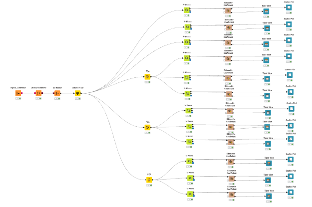
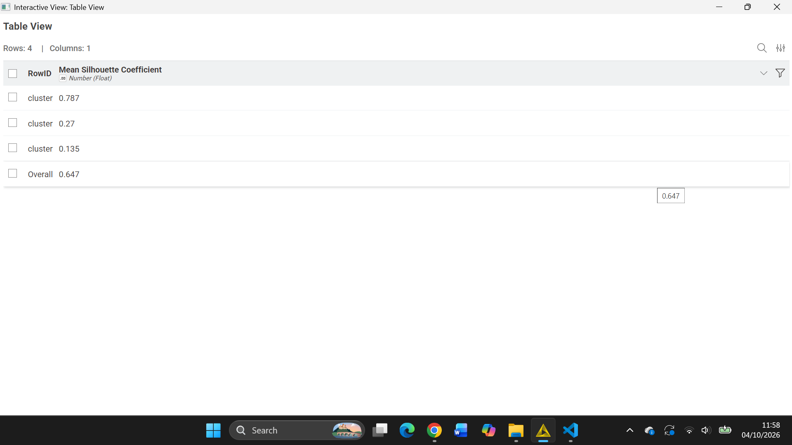
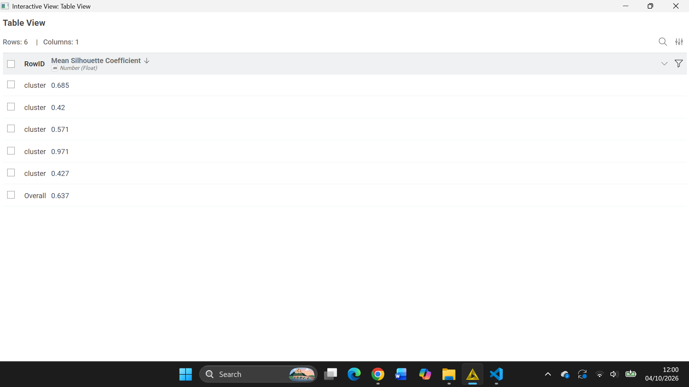
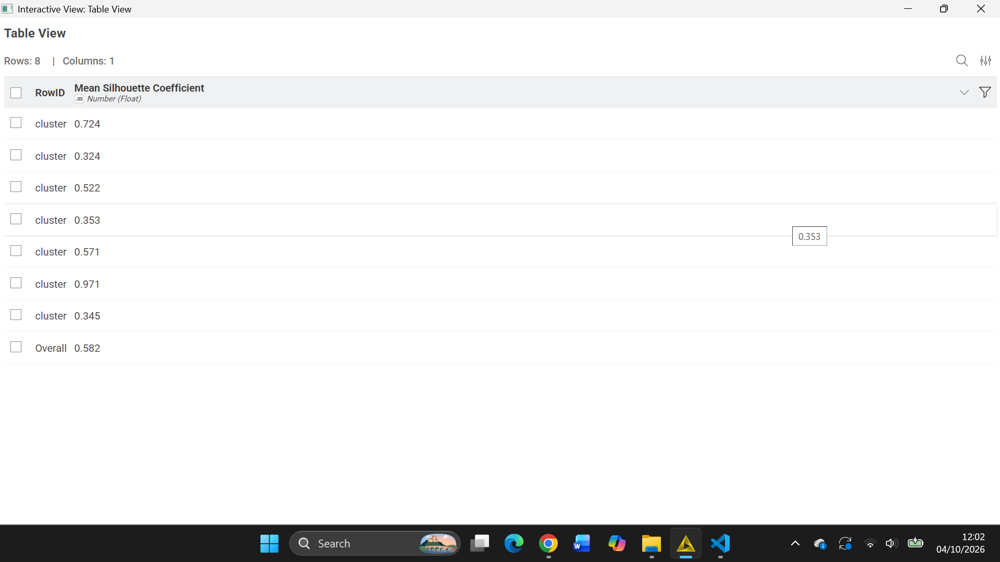
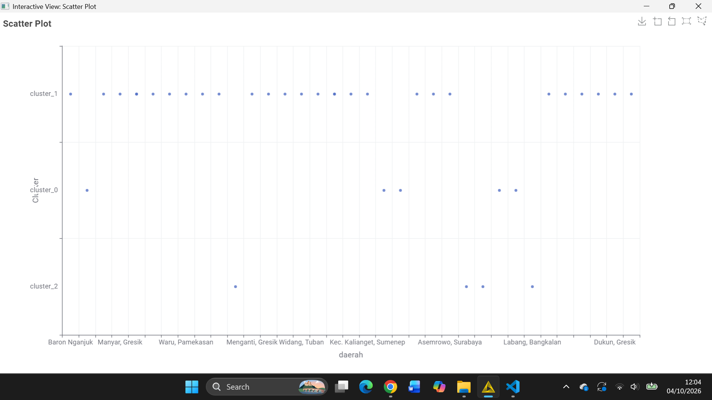
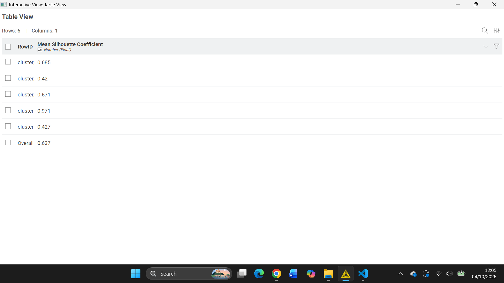
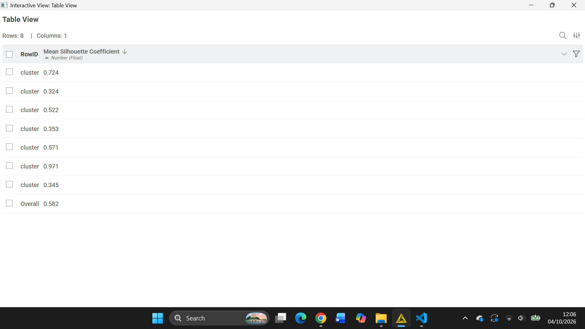
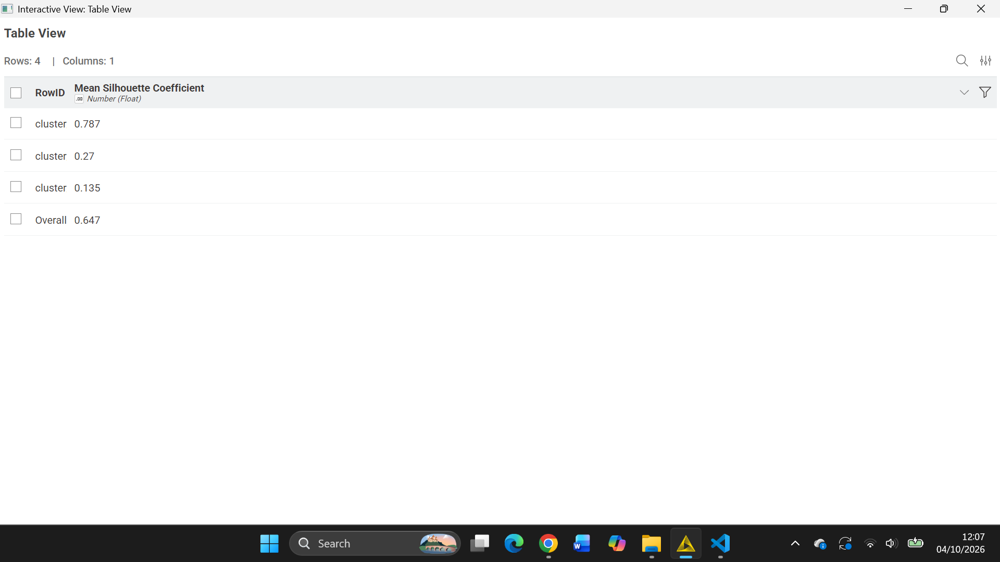
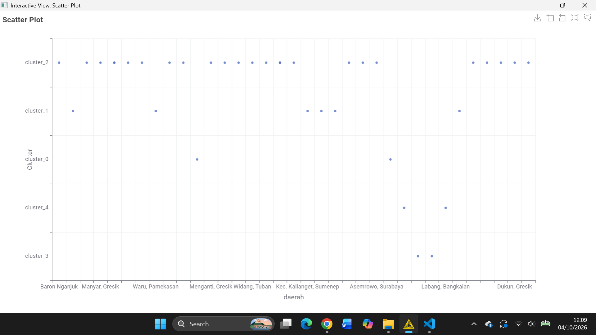
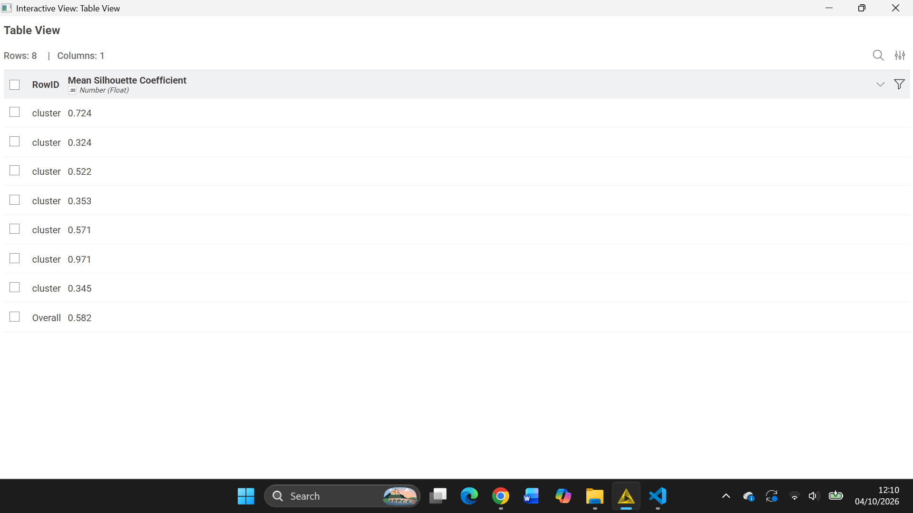

---
jupytext:
  formats: md:myst
  text_representation:
    extension: .md
    format_name: myst
    format_version: 0.13
    jupytext_version: 1.11.5
kernelspec:
  display_name: Python 3
  language: python
  name: python3
---

# K-Means Clustering pada Data Polutan Versi Linier

## 1. Gambaran umum

Bagian ini menjelaskan persiapan analisis K-Means pada data polutan Kertosono versi linier. Data yang digunakan adalah [`Linier-Kertosono-TSFEL.csv`](../../Linier-Kertosono-TSFEL.csv), yaitu fitur TSFEL dari deret waktu CO, NO₂, dan SO₂ yang diproses melalui tahap preprocessing dengan interpolasi linier.

Istilah **versi linier** merujuk pada metode interpolasi saat preprocessing data deret waktu. Istilah tersebut bukan berarti K-Means merupakan model linier. K-Means tetap merupakan algoritma klasterisasi berbasis jarak.

## 2. Dataset yang digunakan

Berkas `Linier-Kertosono-TSFEL.csv` memiliki 204 kolom fitur numerik:

| Polutan | Jumlah fitur |
|---|---:|
| NO₂ | 68 |
| SO₂ | 68 |
| CO | 68 |
| **Total** | **204** |

Setiap kolom merepresentasikan fitur hasil ekstraksi, sedangkan setiap baris seharusnya merepresentasikan satu observasi yang akan dikelompokkan. Pemeriksaan berkas yang tersedia menunjukkan bahwa saat ini hanya ada **1 baris observasi**.

Fitur-fitur tersebut mencakup karakteristik sinyal, seperti statistik, energi, korelasi, frekuensi, dan karakteristik temporal atau fraktal. Fitur-fitur ini dapat menjadi variabel masukan model apabila tersedia cukup banyak observasi dengan struktur yang sama.

## 3. Kelayakan K-Means pada data saat ini

K-Means mengelompokkan baris observasi. Dengan satu baris, dataset hanya memiliki satu titik dalam ruang 204 dimensi. Satu titik tidak dapat dibagi menjadi dua atau lebih klaster yang bermakna.

Karena itu, dari berkas saat ini:

- K-Means dengan `k >= 2` belum dapat dijalankan secara valid;
- Silhouette Coefficient belum dapat dihitung;
- jumlah klaster terbaik belum dapat ditentukan;
- PCA belum dapat merangkum variasi antarobservasi; dan
- hasil serta visualisasi klaster dari eksperimen lain tidak dapat dianggap sebagai hasil dataset linier ini.

Dengan demikian, dokumen ini tidak mencantumkan skor atau gambar hasil klaster yang belum dihasilkan dari data linier.

## 4. Workflow yang disarankan

Setelah tersedia beberapa observasi, alur KNIME untuk dataset CSV dapat disusun sebagai berikut:

1. **CSV Reader**  
   Membaca `Linier-Kertosono-TSFEL.csv` ke dalam workflow.

2. **Pemeriksaan data**  
   Memastikan setiap baris mewakili unit observasi yang sama, semua fitur bertipe numerik, tidak ada nilai kosong yang belum ditangani, dan tidak ada baris duplikat yang tidak disengaja.

3. **Column Filter**  
   Memilih fitur numerik yang digunakan sebagai masukan. Jika kolom identitas atau keterangan ditambahkan pada tahap berikutnya, keluarkan kolom tersebut dari perhitungan jarak.

4. **Standardisasi fitur**  
   Menyamakan skala fitur sebelum K-Means agar fitur bernilai besar tidak mendominasi jarak Euclidean. Parameter standardisasi dihitung dari observasi yang digunakan untuk pemodelan.

5. **PCA (opsional)**  
   PCA dapat dicoba setelah jumlah observasi mencukupi dan data telah disiapkan. Tentukan jumlah komponen berdasarkan variasi yang ingin dipertahankan, kemudian bandingkan hasilnya dengan skenario tanpa PCA. Jangan menganggap penggunaan PCA otomatis mempertahankan kualitas klaster.

6. **K-Means**  
   Uji beberapa kandidat `k` yang sesuai dengan jumlah observasi. Setiap klaster yang terbentuk harus memiliki anggota agar hasilnya dapat dievaluasi.

7. **Evaluasi dan visualisasi**  
   Hitung Silhouette Coefficient untuk kandidat `k` yang valid, lalu tampilkan jumlah anggota dan ringkasan karakteristik setiap klaster. Scatter plot dapat digunakan sebagai bantuan visual, bukan pengganti evaluasi.

## 5. Data yang perlu disiapkan

Agar K-Means dapat diterapkan, dataset perlu memiliki lebih dari satu baris, dengan setiap baris mewakili observasi yang sebanding. Salah satu pendekatan adalah menghitung fitur TSFEL secara terpisah untuk beberapa jendela waktu. Setiap jendela harus menghasilkan himpunan 204 fitur yang konsisten, dengan definisi fitur dan urutan kolom yang sama.

Jangan memperlakukan 204 kolom fitur pada satu baris sebagai 204 observasi. Kolom-kolom tersebut mengukur karakteristik yang berbeda dan bukan sampel sejenis yang dapat langsung dikelompokkan sebagai baris.

Setelah observasi tambahan tersedia:

1. pastikan unit observasi dan rentang jendela waktu ditetapkan dengan jelas;
2. gunakan fitur yang sama untuk setiap observasi;
3. periksa nilai kosong, tipe data, dan skala fitur;
4. jalankan K-Means pada data yang telah distandardisasi;
5. hitung Silhouette Coefficient hanya ketika terbentuk sekurang-kurangnya dua klaster yang valid; dan
6. laporkan nilai evaluasi yang benar-benar dihasilkan dari dataset linier.

## 6. Interpretasi

Belum ada hasil klaster yang dapat diinterpretasikan karena berkas saat ini hanya memuat satu observasi. Oleh sebab itu, belum dapat disimpulkan apakah data memiliki pola kelompok tertentu, nilai `k` mana yang terbaik, atau apakah PCA meningkatkan kualitas klaster.

Setelah model dapat dijalankan, interpretasi sebaiknya didasarkan pada ukuran tiap klaster dan ringkasan fitur CO, NO₂, dan SO₂ pada masing-masing kelompok. Label klaster sendiri tidak otomatis menunjukkan tingkat pencemaran; maknanya perlu ditelaah melalui fitur dan konteks data.

## 7. Dokumentasi visual yang tersedia

Gambar workflow dan visualisasi eksperimen yang sudah tersedia di folder proyek tetap disertakan di bawah ini. Gambar hasil klaster merupakan dokumentasi visual yang sudah ada; belum dapat dipastikan bahwa gambar tersebut dihasilkan dari `Linier-Kertosono-TSFEL.csv`. Karena dataset linier saat ini hanya memiliki satu baris, gambar-gambar ini **bukan hasil evaluasi untuk data linier** dan tidak digunakan untuk menyimpulkan skor atau jumlah klaster terbaik.

### Tanpa reduksi dimensi

#### k = 3

#### k = 5

#### k = 7

### PCA 203 fitur

#### k = 3

#### k = 5

#### k = 7

### PCA 74 fitur

#### k = 3

#### k = 5

#### k = 7

### PCA 37 fitur

#### k = 3

#### k = 5

#### k = 7

## 8. Kesimpulan

Dataset polutan Kertosono versi linier yang tersedia berisi 204 fitur TSFEL—masing-masing 68 fitur untuk NO₂, SO₂, dan CO—tetapi hanya memiliki satu baris observasi. Jumlah tersebut belum mencukupi untuk membentuk klaster K-Means maupun menghitung Silhouette Coefficient. PCA juga belum dapat memberikan reduksi dimensi yang bermakna untuk pola antarobservasi.

Langkah berikutnya adalah menyiapkan beberapa observasi dengan struktur fitur yang konsisten, misalnya fitur yang diekstrak dari beberapa jendela waktu. Setelah data tersebut tersedia, K-Means, PCA opsional, dan evaluasi silhouette dapat dijalankan, lalu hasil aktualnya digunakan dalam laporan.

## 9. Kesimpulan singkat untuk laporan

Analisis K-Means direncanakan menggunakan data polutan Kertosono versi linier yang terdiri atas 204 fitur TSFEL untuk CO, NO₂, dan SO₂. Namun, berkas yang tersedia saat ini hanya memiliki satu baris observasi, sehingga klasterisasi dan evaluasi Silhouette Coefficient belum dapat dilakukan secara valid. Data perlu dilengkapi dengan beberapa observasi yang sebanding sebelum jumlah klaster terbaik dan hasil evaluasi dapat disimpulkan.
